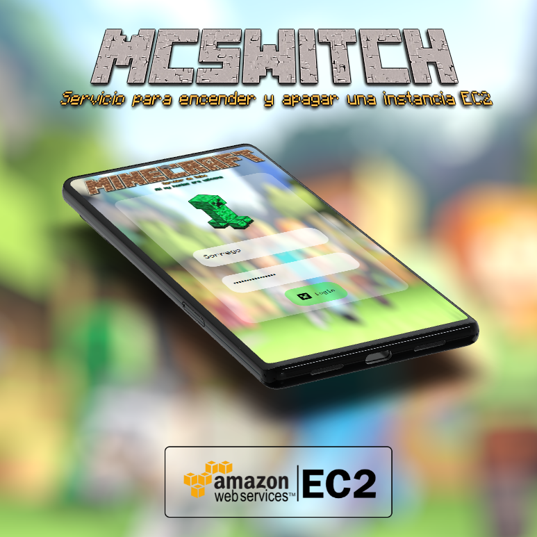
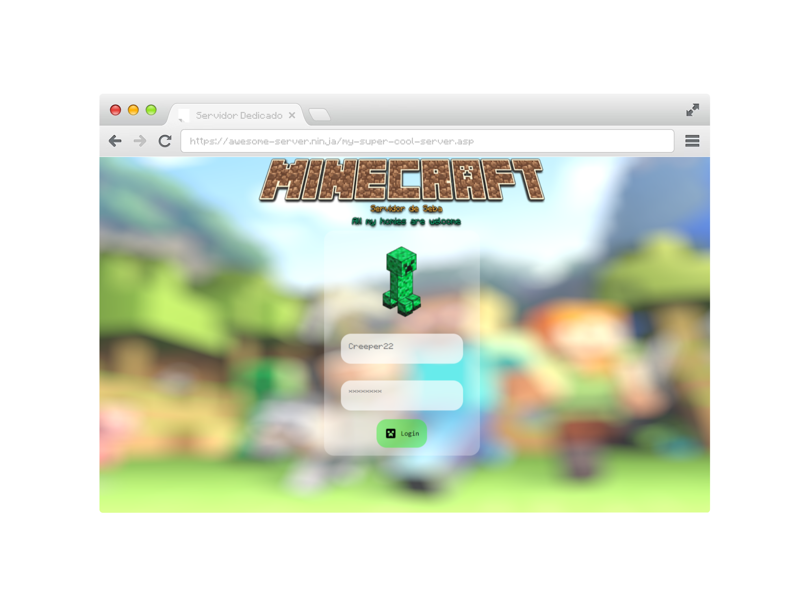

  

# MCSWITCH

  Un servicio para encender y apagar una instancia EC2. Yo lo uso para manejar mi server minecraft :)

## Pantallazos / Capturas de pantalla.

### Version de escritorio.

  

## Referencias

- [imágen del botón de creeper por iconos8](https://iconos8.es/icons/set/minecraft-creeper)
- [Uso de fuentes personalizadas en CSS](https://www.pagecloud.com/blog/how-to-add-custom-fonts-to-any-website)
- [B0rr4r b0rd3 d3 1nputs 4ct1v0s](https://stackoverflow.com/questions/16156594/how-to-change-border-color-of-textarea-on-focus)
- [Letras del Minecraft](https://textcraft.net/)
- [Mockup](https://previewed.app/)
- [Minecraft faces](https://minecraftfaces.com/)